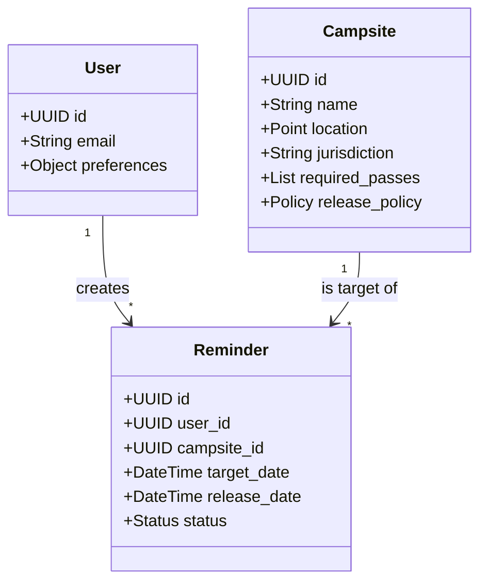

# Data Model - Robot Geographical Society

## Entities

### 1. Campsite
Represents a specific campground or site.

| Field | Type | Description |
| :--- | :--- | :--- |
| `id` | UUID | Primary Key |
| `name` | String | Name of the campsite |
| `location` | GeoJSON | Coordinates for Mapbox |
| `jurisdiction` | Enum | State Park, National Park, National Forest, etc. |
| `required_passes` | Array | [Discover Pass, Northwest Forest Pass, etc.] |
| `booking_url` | String | Link to official reservation page |
| `release_policy` | Object | Rules for when sites are released (e.g., "6 months rolling") |

### 2. User
| Field | Type | Description |
| :--- | :--- | :--- |
| `id` | UUID | Primary Key |
| `email` | String | For notifications |
| `preferences` | Object | Default filters, notification settings |

### 3. Reminder
| Field | Type | Description |
| :--- | :--- | :--- |
| `id` | UUID | Primary Key |
| `user_id` | UUID | FK to User |
| `campsite_id` | UUID | FK to Campsite |
| `target_date` | Date | The date the user wants to camp |
| `release_date` | Date | When the reservation window opens |
| `status` | Enum | [Pending, Notified, Triggered, Cancelled] |
| `webhook_url` | String | (Optional) URL to call for automated booking |

## Diagrams

