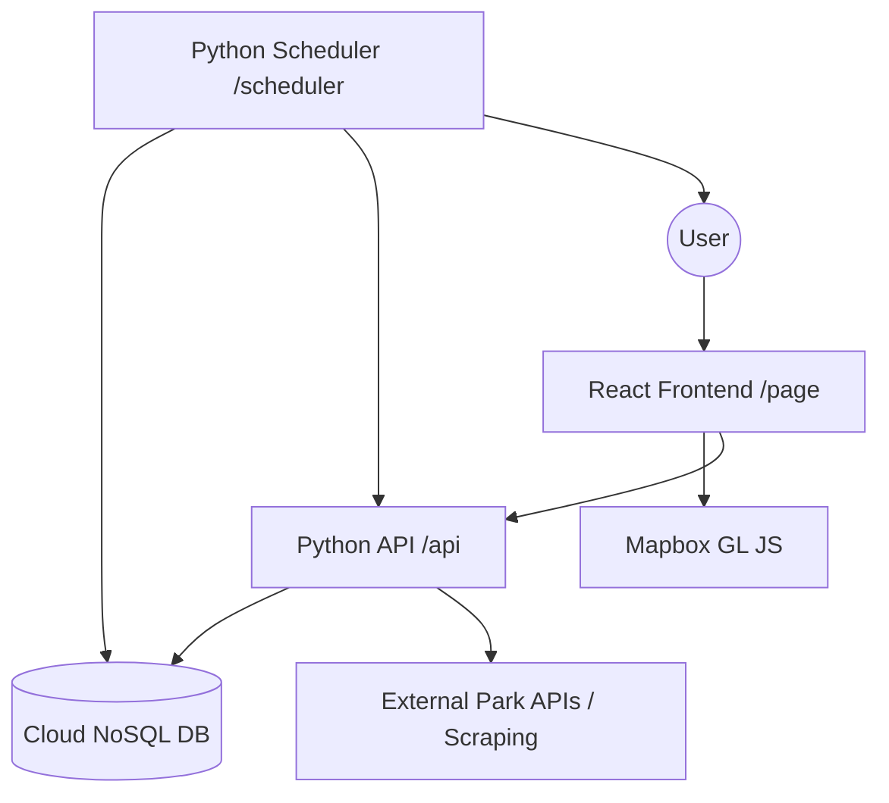

# Robot Geographical Society (RGS) - Design Document

## Overview
RGS is a campsite planning and booking assistant for Washington State. It helps users find campsites across different jurisdictions (National Parks, State Parks, National Forests), tracks availability, and provides a scheduling engine for booking reminders.

## Architecture

## Component Breakdown

### 1. Frontend (`/page`)
- **React SPA**: Hosted on GitHub Pages.
- **Mapbox GL JS**: Primary interface for spatial filtering and campsite visualization.
- **State Management**: React Context or Redux for managing search filters, user preferences, and reminder state.
- **Styling**: Vanilla CSS (or as preferred by project conventions).

### 2. Backend API (`/api`)
- **Python (FastAPI or Flask)**: Provides endpoints for campsite data, user profiles, and reminder management.
- **Data Aggregator**: Logic to normalize data from various park reservation systems.

### 3. Scheduler (`/scheduler`)
- **Python Service**: Monitors upcoming reservation windows.
- **Notification Engine**: Initially web-standard channels (e.g., email via SendGrid or AWS SES).
- **Automation Hooks**: Designed to trigger webhooks for future booking automation.

### 4. Database
- **Choice**: **MongoDB Atlas** (Free Tier) or **AWS DynamoDB**.
- **Reasoning**: Flexible schema for varied campsite data and easy scaling for notification logs.

## User Flows

### Finding a Campsite
1. User opens the map.
2. User filters by "Western Washington" and "Date".
3. UI queries API.
4. API returns cached or fresh availability data.
5. Map renders pins with travel time and pass requirements.

### Setting a Reminder
1. User selects a "Favorite" campsite.
2. User clicks "Set Reminder" for a specific date range.
3. Web UI sends request to API.
4. API stores reminder in DB.
5. Scheduler identifies when the booking window opens (e.g., 6 months prior).
6. Scheduler notifies user 24 hours before and at the exact time of release.
